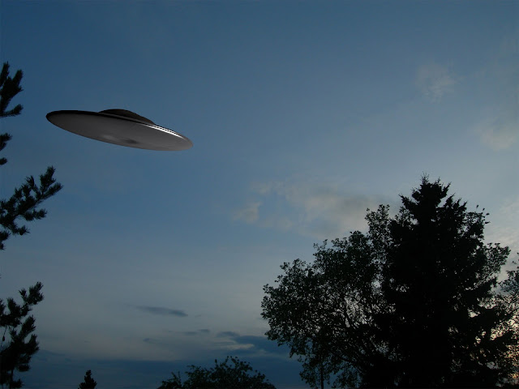

```{r load-packages, include = FALSE}
# Add any additional packages you need to this chunk
library(tidyverse)
library(palmerpenguins)
library(knitr)
library(xaringanthemer)
```

```{r load-data, include = FALSE}
complete <- read_csv("complete.csv")
```

```{r setup, include=FALSE}
# For better figure resolution
knitr::opts_chunk$set(fig.retina = 3, dpi = 300, fig.width = 6, fig.asp = 0.618, out.width = "80%")
```


```{r include=FALSE}
style_xaringan(
  title_slide_background_image = "img/1.jpg"
)
```

class: center, middle

## A statement of the dataset and our research question

For our final project,We will use UFO Sightings Dataset,which was collected by NATIONAL UFO REPORTING CENTER (NUFORC).It contains 88875 records of reported UFO Sightings from 1906-2014.
   
Our analysis will seek to answer the following questions:
   
1.What kinds of shape were recorded,and what is the most common shape?

2.Which area has the highest frequency of UFO Sightings? 

3.Which hemisphere has more UFO sighting appeared?

---
This is the output of our data.
```{r,echo = FALSE}
 glimpse(complete)
```
---

class: inverse, center, middle

##1.The most common shape of UFO

---
We use shape variable to solve this question
```{r,echo = FALSE}
complete%>%
  count(shape)%>%
  arrange(desc(n))


```

We find UFO have 30 different shapes,they also contain unknown shape,so maybe they have more shapes.

The most common shape is light,it is much more than the triangle.

---

class: inverse, middle, center

#2.The area that has the highest frequency of UFO Sightings

---
In this question, we use variable "country" to find out the country with highest number of UFO Sightings.(The variable "country" with "NA" is named as Other.)

```{r,echo = FALSE}
complete %>%
  mutate(country = 
           case_when(
             country == "au" ~ "Australia",
             country == "ca" ~ "Canada",
             country == "de" ~ "Germany",
             country == "gb" ~ "Great Britain",
             country == "us" ~ "United States of America",
             TRUE ~ "Other"
        )) %>%
  count(country) %>%
  arrange(desc(n)) %>%
  rename(number = n) 
```
We find the United States of America has the highest number of UFO Sightings.
---
We can also use variable "state" and "city" to find the city with highest number of UFO Sightings in US.
```{r recode-country, echo = FALSE}
complete %>%
  mutate(country = 
           case_when(
             country == "au" ~ "Australia",
             country == "ca" ~ "Canada",
             country == "de" ~ "Germany",
             country == "gb" ~ "Great Britain",
             country == "us" ~ "United States of America",
             TRUE ~ "Other"
        )) %>%
  filter(country == "United States of America")%>%
  count(city,state) %>%
  arrange(desc(n)) %>%
  rename(number = n)
```

---

class: inverse, middle, center

#3.The hemisphere that have more UFO seighting


---
In this question, variable "latitude" is used to discuss the question.
We will first look at the sightings happened in equator.

```{r,echo = FALSE}
equator <- filter(complete, latitude== "0")
count(equator, latitude)
```
Then look at the sightings in southern hemisphere

```{r,echo = FALSE}
southernhemisphere <- filter(complete,latitude < "0")
count(southernhemisphere, latitude) %>%
  arrange(desc(n))
```


---
Then look at the sightings in northern hemisphere.
 
```{r,echo = FALSE}
northernhemisphere <- filter(complete, latitude > "0")
count(northernhemisphere, latitude) %>%
  arrange(desc(n))
```
From the data, we can find that it is clear that if UFO sighting is real, then it is more likely to be seen in northern hemisphere.

---

#Thanks!

```{r echo = FALSE, out.width = "60%", fig.align = "center"}

```

